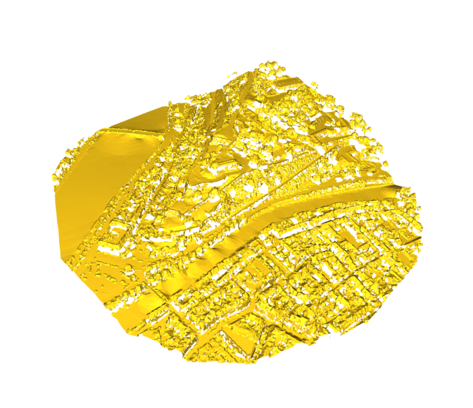

# 3D_House

# Goal

Render a 3D visualization of a geolocation using latitude / longitutde and LIDAR data.

#### What is LIDAR ?

LIDAR is a method to measure distance using light. The device will illuminate a target with a laser light and a sensor will measure the reflection. Differences in wavelength and return times will be used to get 3D representations of an area.

Here is a LIDAR segmentation :

With those points clouds we can easily identify houses, vegetation, roads, etc...

The results we're insterested in are DSM (Digital Surface Map) and DTM (Digital Terrain Map).

The DSM file being heavy I only used the DSM for Namur Province in development process. 

# Requirements

* Pyproj : to convert the latitude and longitude into the correct espg format
* Rasterio : to open and work with DSM & DTM files
* Raster2xyz : to convert .tif into xyz coordinates
* Pandas : to read csv files where the xyz coordinates are stored
* NumPy : to convert the dataframe containing the pointcloud in a matrix
* Open3d : to help rendering the pointcloud and exporting the mesh created

# How it works

* The user is prompted to enter an address , then the adress is used to request the coordinates by openstreetmap
- [address_to_latlng.py](https://github.com/MDropsy/3D_House/blob/main/address_to_latlng.py)

* The latitude and longitude are then converted to the coorect ESPG format using Pyproj , then use the coordinates to make a geojson polygon
- [geojson_transform.py](https://github.com/MDropsy/3D_House/blob/main/geojson_transform.py)

* The DSM is then opened and cropped into a polygon around the area of the adress entered by the user
- [clipping_tif.py](https://github.com/MDropsy/3D_House/blob/main/clipping_tif.py)

* In the main file, the cropped polygon is converted into xyz coordinates used to make the pointcloud. Using open3d we can then create and render the mesh. After visualizing the mesh , you can save it in a .obj to use it in any 3d software.
- [main.py](https://github.com/MDropsy/3D_House/blob/main/main.py)

# Exemple 

Entered address : Route Merveilleuse 64, 5000 Namur

